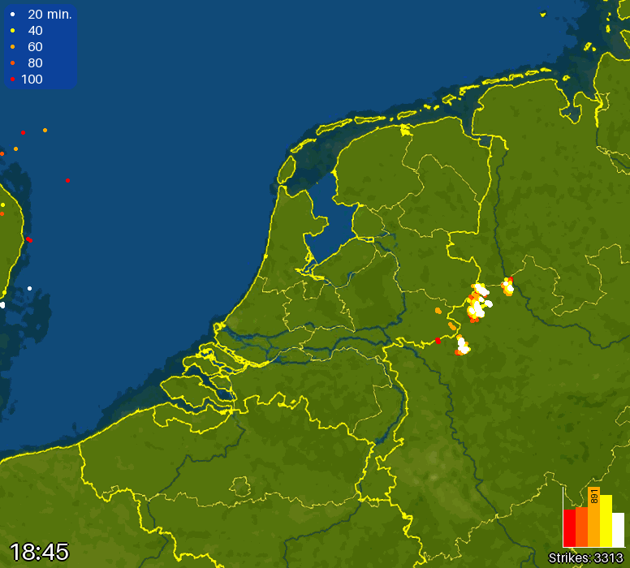

[![GitHub Release][releases-shield]][releases]
[![GitHub Activity][commits-shield]][commits]
![Install Stats][stats]

![Project Maintenance][maintenance-shield]
[![Community Forum][forum-shield]][forum]

# Blitzortung Image

This is a custom integration of the Blitzortung Image. It will provide an animated image representing the lightning data (only for The Netherlands). You need to be a participant of the Blitzortung lightning detection network project.

## Installation

Via HACS:

- Add the following custom repository as an integration:
    - MarcoGos/blitzortung_image
- Restart Home Assistant
- Add the integration to Home Assistant

## Setup

- Username
- Password

This information will be provided ones you become a participant of the Blitzortung lightning detection network project. See https://www.blitzortung.org/en/cover_your_area.php for more information.

## What to expect

The following images (cameras) will be registered:

- Lightning

The following sensors will be registered

- Latitude Marker
- Longitude Marker

The following switch will be registered

- Show Activity Graph
    - This will show the activity graph
- Show/Hide Marker
    - This will automatically update all enabled images (cameras)
- Show Legend
    - This will show the legend

The following action will be registered

- "Force Update"
    - Update the marker on the images after the latitude and/or longitude values changed.

## Examples

[commits-shield]: https://img.shields.io/github/commit-activity/y/MarcoGos/blitzortung_image.svg?style=for-the-badge
[commits]: https://github.com/MarcoGos/blitzortung_image/commits/main
[forum-shield]: https://img.shields.io/badge/community-forum-brightgreen.svg?style=for-the-badge
[forum]: https://community.home-assistant.io/
[maintenance-shield]: https://img.shields.io/badge/maintainer-%40MarcoGos-blue.svg?style=for-the-badge
[releases-shield]: https://img.shields.io/github/release/MarcoGos/blitzortung_image.svg?style=for-the-badge
[releases]: https://github.com/MarcoGos/blitzortung_image/releases
[stats]: https://img.shields.io/badge/dynamic/json?color=41BDF5&logo=home-assistant&label=integration%20usage&suffix=%20installs&cacheSeconds=15600&url=https://analytics.home-assistant.io/custom_integrations.json&query=$.blitzortung_image.total&style=for-the-badge